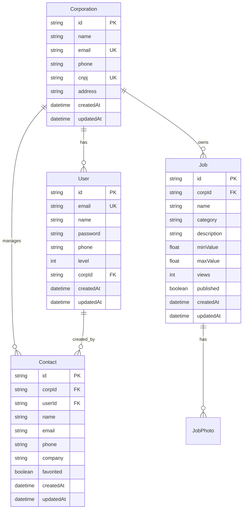
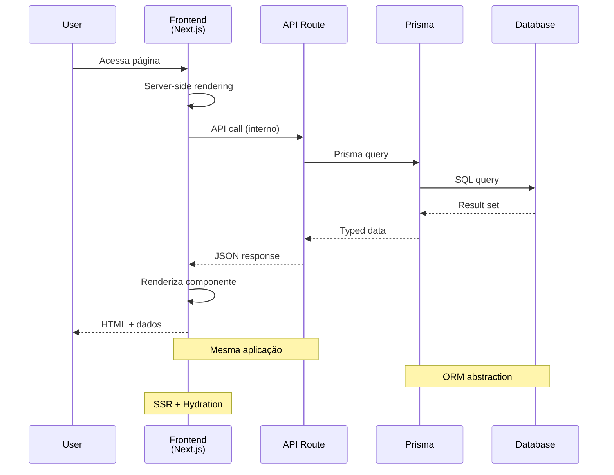
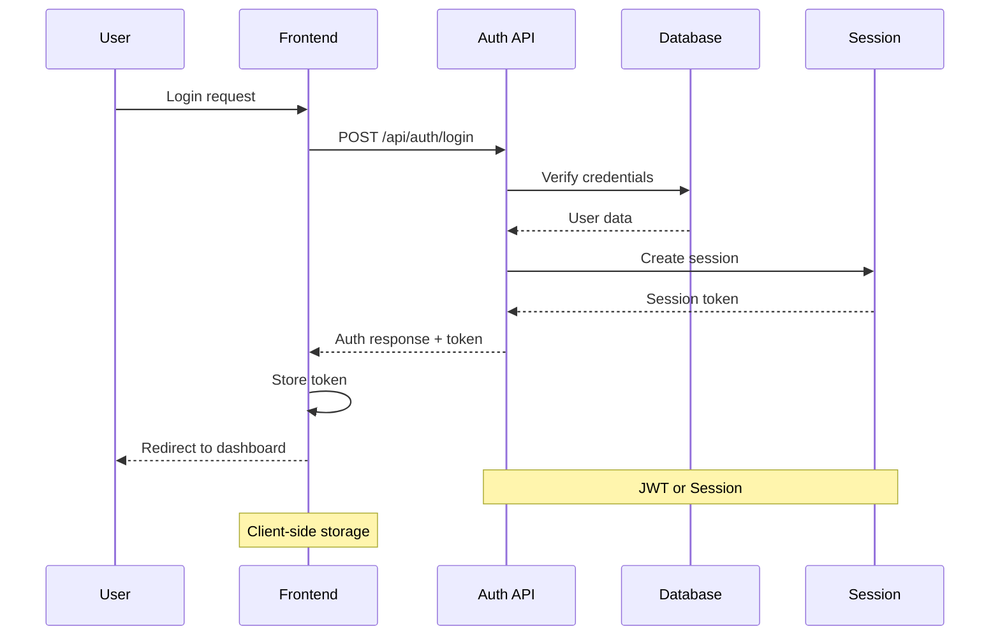

# LinkMeTur - Arquitetura do Sistema

## 📋 Índice
- [Visão Geral da Arquitetura](#visão-geral-da-arquitetura)
- [Estrutura do Projeto](#estrutura-do-projeto)
- [Frontend (Next.js)](#frontend-nextjs)
- [Banco de Dados](#banco-de-dados)
- [Fluxo de Dados](#fluxo-de-dados)
- [Padrões de Design](#padrões-de-design)
- [Segurança](#segurança)
- [Performance](#performance)

## 🏗️ Visão Geral da Arquitetura

O LinkMeTur utiliza uma **arquitetura monolítica moderna** com Next.js 15, focando em simplicidade, performance e facilidade de manutenção.

### Arquitetura de Alto Nível

```mermaid
graph TB
    subgraph "Cliente"
        Browser[Navegador Web]
        Mobile[Dispositivos Móveis]
    end
    
    subgraph "Aplicação"
        NextJS[Next.js 15<br/>Port: 3000]
        API[API Routes<br/>Built-in]
    end
    
    subgraph "Dados"
        SQLite[(SQLite<br/>Desenvolvimento)]
        PostgreSQL[(PostgreSQL<br/>Produção)]
        Redis[(Redis<br/>Cache)]
    end
    
    Browser --> NextJS
    Mobile --> NextJS
    NextJS --> API
    API --> SQLite
    API --> PostgreSQL
    API --> Redis
    
    style NextJS fill:#0070f3
    style API fill:#00d8ff
    style SQLite fill:#003b57
    style PostgreSQL fill:#336791
    style Redis fill:#dc382d
```



### Características Arquiteturais

- ✅ **Monolito Modular**: Uma aplicação, múltiplos módulos
- ✅ **API-First**: API Routes nativas do Next.js
- ✅ **Type Safety**: TypeScript em todo o stack
- ✅ **Modern Stack**: Tecnologias atuais e bem suportadas
- ✅ **Database Agnostic**: SQLite para dev, PostgreSQL para prod
- ✅ **Cache Ready**: Redis para cache e sessões

## 📁 Estrutura do Projeto

```
LinkMeTur/
├── 📁 frontend/                # Aplicação Next.js 15
│   ├── 📁 src/
│   │   ├── 📁 app/            # App Router
│   │   │   ├── 📁 api/        # API Routes
│   │   │   │   ├── 📁 auth/   # Autenticação
│   │   │   │   ├── 📁 contacts/ # Contatos
│   │   │   │   ├── 📁 corporations/ # Empresas
│   │   │   │   └── 📁 jobs/   # Serviços
│   │   │   ├── 📁 dashboard/  # Dashboard
│   │   │   ├── 📁 login/      # Login
│   │   │   ├── 📁 register/   # Cadastro
│   │   │   ├── 📄 layout.tsx  # Layout raiz
│   │   │   ├── 📄 page.tsx    # Página inicial
│   │   │   └── 📄 globals.css # Estilos globais
│   │   └── 📁 lib/            # Utilitários
│   │       └── 📄 prisma.ts   # Cliente Prisma
│   ├── 📁 prisma/             # Schema e migrations
│   │   ├── 📄 schema.prisma   # Schema do banco
│   │   ├── 📄 seed.ts         # Dados iniciais
│   │   └── 📄 dev.db          # SQLite (dev)
│   ├── 📁 public/             # Assets estáticos
│   ├── 📄 package.json        # Dependências
│   ├── 📄 next.config.ts      # Config Next.js
│   └── 📄 tailwind.config.js  # Config Tailwind
├── 📁 scripts/                # Scripts de banco
├── 📁 nginx/                  # Config Nginx
├── 📄 docker-compose.dev.yml  # Infraestrutura dev
├── 📄 package.json            # Workspace root
└── 📄 start-dev.sh           # Script de início
```

## 🎨 Frontend (Next.js)

### Arquitetura do Frontend

```mermaid
graph TB
    subgraph "Next.js Application"
        subgraph "App Router"
            Layout[layout.tsx<br/>Root Layout]
            Pages[Pages<br/>page.tsx]
            API[API Routes<br/>route.ts]
        end
        
        subgraph "Data Layer"
            Prisma[Prisma Client<br/>Database ORM]
            SQLite[SQLite<br/>Development]
            PostgreSQL[PostgreSQL<br/>Production]
        end
        
        subgraph "Styling"
            Tailwind[Tailwind CSS<br/>Utility Classes]
            GlobalCSS[globals.css<br/>Global Styles]
        end
        
        subgraph "Authentication"
            NextAuth[NextAuth.js<br/>Authentication]
            JWT[JWT Tokens<br/>Session Management]
        end
    end
    
    Layout --> Pages
    Pages --> API
    API --> Prisma
    Prisma --> SQLite
    Prisma --> PostgreSQL
    Layout --> Tailwind
    Layout --> GlobalCSS
    API --> NextAuth
    NextAuth --> JWT
    
    style Layout fill:#0070f3
    style Pages fill:#00d8ff
    style API fill:#10b981
    style Prisma fill:#2d3748
    style Tailwind fill:#06b6d4
```



### Componentes do Frontend

#### 1. **App Router** - Sistema de Roteamento
```typescript
// Estrutura de rotas
app/
├── page.tsx           # / (home)
├── login/page.tsx     # /login
├── register/page.tsx  # /register
├── dashboard/page.tsx # /dashboard
└── api/
    ├── auth/
    ├── contacts/
    ├── corporations/
    └── jobs/
```

#### 2. **API Routes** - Backend Integrado
```typescript
// Padrão de API Route
export async function GET(request: Request) {
  // Lógica de busca
  return Response.json({ data })
}

export async function POST(request: Request) {
  // Lógica de criação
  return Response.json({ success: true })
}
```

#### 3. **Prisma Integration** - ORM
```typescript
// Cliente Prisma
import { PrismaClient } from '@prisma/client'

const prisma = new PrismaClient()

// Operações CRUD
const users = await prisma.user.findMany()
const user = await prisma.user.create({ data })
```

### Padrões Implementados

1. **App Router Pattern**: Roteamento baseado em arquivos
2. **Server Components**: Renderização no servidor por padrão
3. **API Routes**: Backend integrado ao frontend
4. **TypeScript First**: Tipagem em tudo
5. **CSS Utility**: Tailwind CSS para estilização

## 🗄️ Banco de Dados

### Arquitetura de Dados



### Configuração do Prisma

```prisma
// Schema principal
generator client {
  provider = "prisma-client-js"
}

datasource db {
  provider = "sqlite"      // Desenvolvimento
  // provider = "postgresql" // Produção
  url      = env("DATABASE_URL")
}

// Modelos principais
model User { ... }
model Corporation { ... }
model Job { ... }
model Contact { ... }
```

### Estratégia de Banco

1. **Desenvolvimento**: SQLite para simplicidade
2. **Produção**: PostgreSQL para robustez
3. **Migrations**: Automáticas via Prisma
4. **Seeding**: Dados iniciais via script
5. **Backup**: Estratégias por ambiente

## 🔄 Fluxo de Dados

### Fluxo de Requisição Completo



### Fluxo de Autenticação



## 🎯 Padrões de Design

### Frontend Patterns

1. **Server Components First**
   - Renderização no servidor por padrão
   - Client Components apenas quando necessário
   - Melhor SEO e performance inicial

2. **API Routes Pattern**
   - Backend integrado ao frontend
   - Roteamento automático baseado em arquivos
   - Type safety entre frontend e backend

3. **Prisma Pattern**
   - Type-safe database access
   - Auto-generated types
   - Migration management

4. **Composition Pattern**
   - Layout composition
   - Component reusability
   - Props drilling prevention

### Code Patterns

1. **TypeScript Strict**
   - Tipagem obrigatória
   - No implicit any
   - Strict null checks

2. **Error Handling**
   - Try-catch em API routes
   - Error boundaries em componentes
   - Graceful degradation

3. **Validation**
   - Input validation
   - Type validation
   - Business rule validation

## 🔒 Segurança

### Medidas de Segurança

1. **Authentication**
   - JWT tokens ou NextAuth.js
   - Secure session management
   - Password hashing (bcrypt)

2. **Authorization**
   - Role-based access control
   - Route protection
   - API endpoint protection

3. **Input Validation**
   - Server-side validation
   - Sanitização de dados
   - SQL injection prevention (Prisma)

4. **Security Headers**
   - CSRF protection
   - XSS protection
   - Content Security Policy

### Implementação

```typescript
// Middleware de autenticação
export async function middleware(request: NextRequest) {
  const token = request.cookies.get('token')
  
  if (!token && request.nextUrl.pathname.startsWith('/dashboard')) {
    return NextResponse.redirect(new URL('/login', request.url))
  }
}

// Validação de entrada
export async function POST(request: Request) {
  const body = await request.json()
  
  // Validação
  if (!body.email || !body.password) {
    return NextResponse.json({ error: 'Missing fields' }, { status: 400 })
  }
  
  // Processamento seguro
}
```

## ⚡ Performance

### Estratégias de Performance

1. **Server-Side Rendering**
   - Renderização no servidor
   - Hydration otimizada
   - Core Web Vitals otimizados

2. **Code Splitting**
   - Lazy loading automático
   - Route-based splitting
   - Component-level splitting

3. **Image Optimization**
   - Next.js Image component
   - Automatic format selection
   - Responsive images

4. **Caching**
   - Static generation quando possível
   - API response caching
   - Database query optimization

### Métricas Alvo

- **First Contentful Paint**: < 1.5s
- **Largest Contentful Paint**: < 2.5s
- **Cumulative Layout Shift**: < 0.1
- **Time to Interactive**: < 3.5s

## 🚀 Escalabilidade

### Estratégias de Escala

1. **Horizontal Scaling**
   - Stateless application design
   - Database read replicas
   - CDN for static assets

2. **Vertical Scaling**
   - Resource optimization
   - Memory management
   - CPU utilization

3. **Caching Strategy**
   - Redis for session storage
   - Database query caching
   - Static asset caching

### Preparação para Microserviços

A arquitetura atual permite migração gradual para microserviços:

1. **API Routes** → **Standalone APIs**
2. **Prisma Models** → **Service Databases**
3. **Shared Types** → **API Contracts**

---

**Última atualização**: setembro 2025
**Versão da Arquitetura**: 2.0.0
**Status**: ✅ Implementado e Funcional