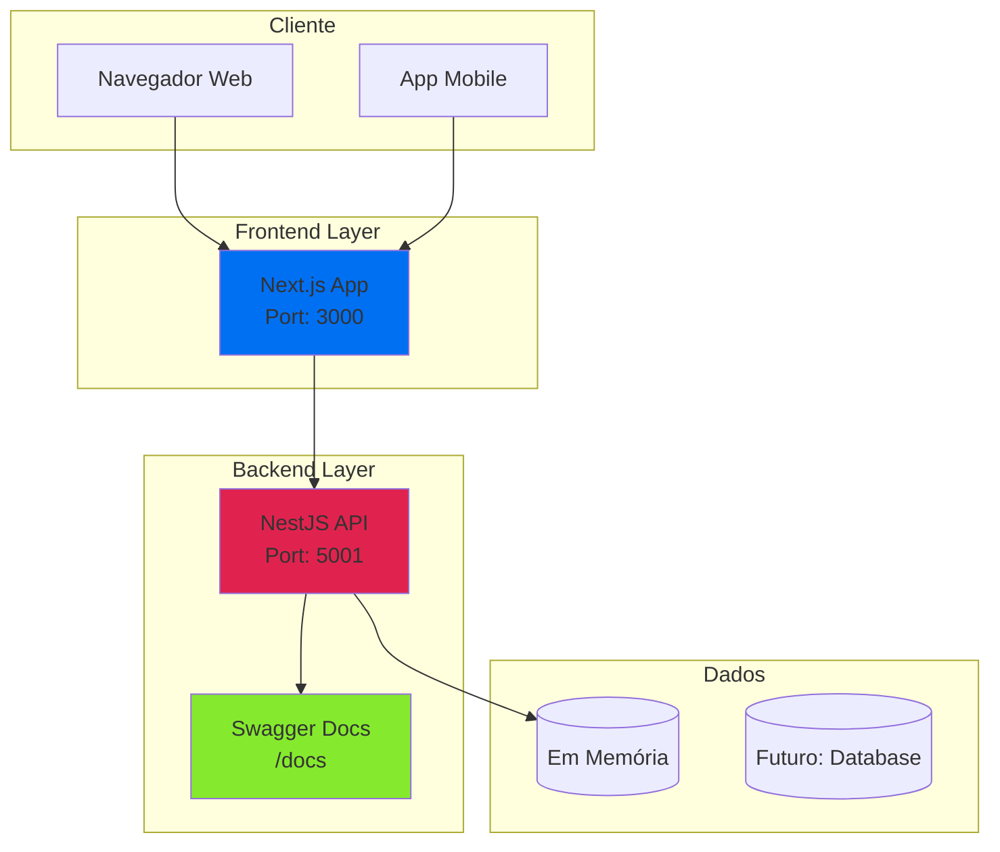
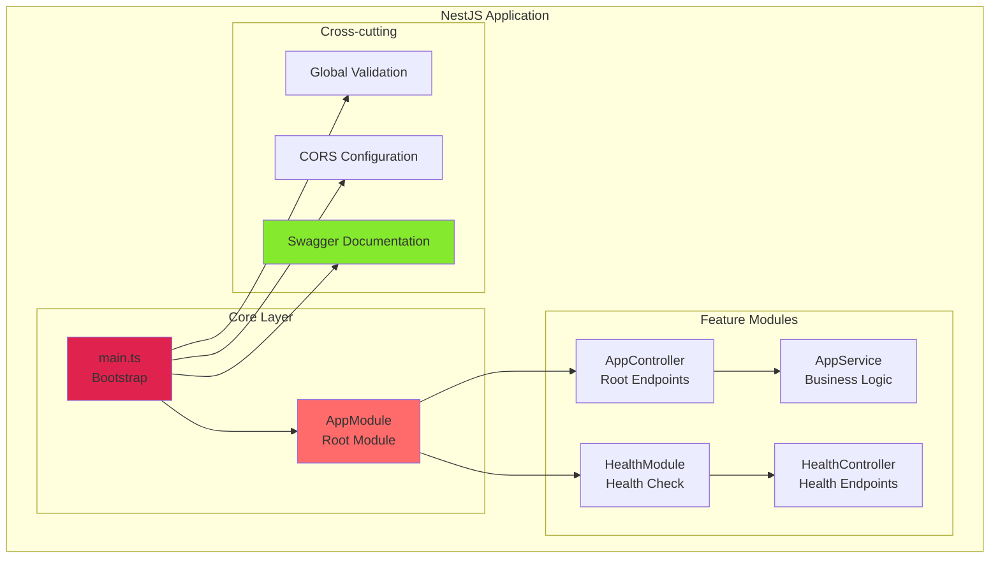
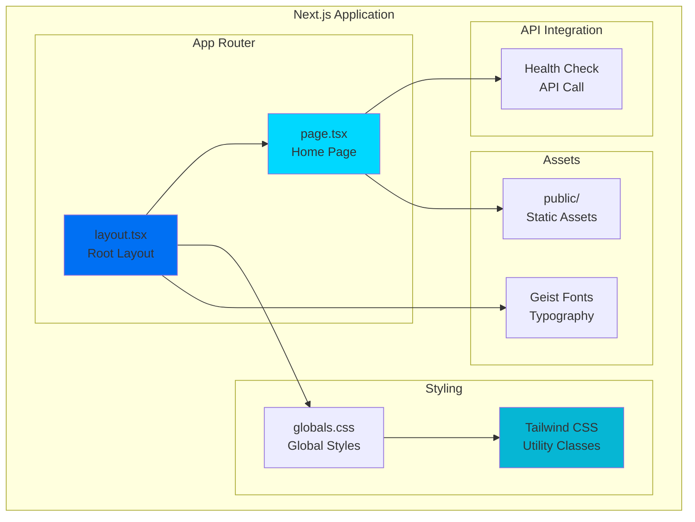
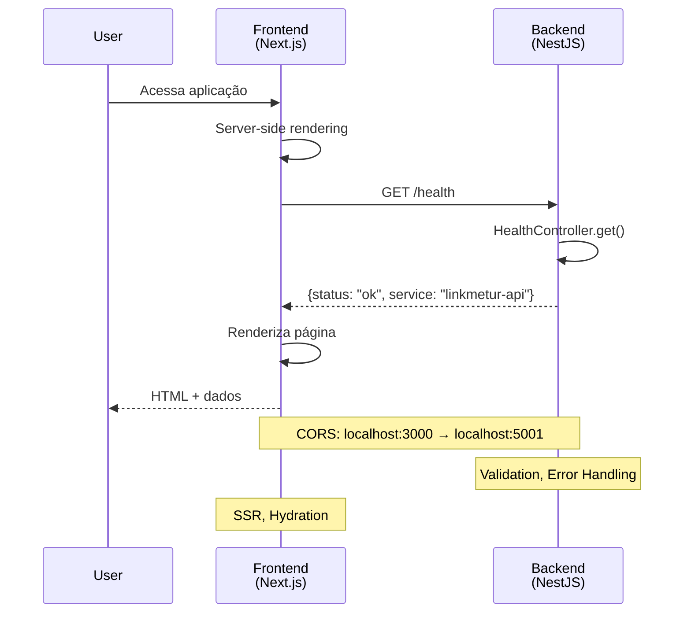
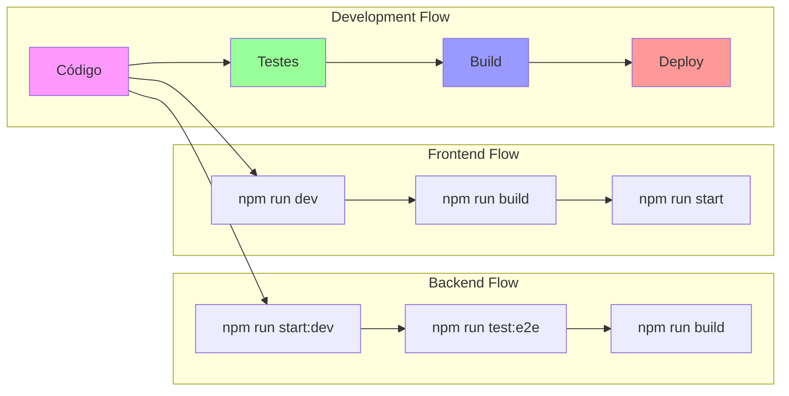
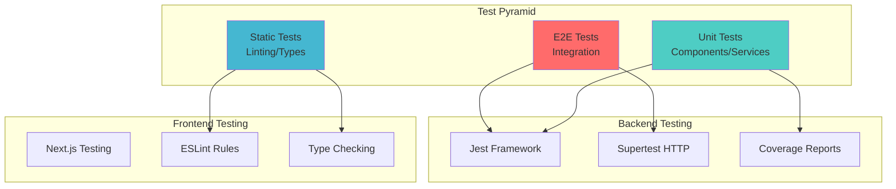
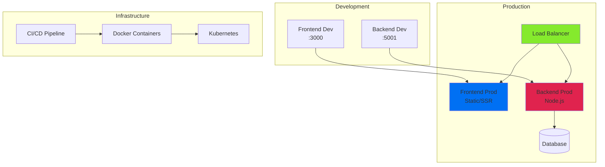

# LinkMeTur - Arquitetura do Sistema

## 📋 Índice
- [Visão Geral da Arquitetura](#visão-geral-da-arquitetura)
- [Estrutura do Projeto](#estrutura-do-projeto)
- [Backend (NestJS)](#backend-nestjs)
- [Frontend (Next.js)](#frontend-nextjs)
- [Fluxo de Dados](#fluxo-de-dados)
- [Padrões de Design](#padrões-de-design)
- [Testes](#testes)
- [Deployment](#deployment)

## 🏗️ Visão Geral da Arquitetura

O LinkMeTur segue uma arquitetura **monorepo** com separação clara entre frontend e backend, utilizando tecnologias modernas para garantir escalabilidade, manutenibilidade e performance.

### Arquitetura de Alto Nível



### Características Arquiteturais

- ✅ **Monorepo**: Gerenciamento centralizado com workspaces
- ✅ **Microservices Ready**: Estrutura preparada para evolução
- ✅ **API-First**: Backend independente com documentação OpenAPI
- ✅ **Type Safety**: TypeScript em todo o stack
- ✅ **Modern Stack**: Tecnologias atuais e bem suportadas
- ✅ **Testing**: Cobertura completa de testes
- ✅ **Documentation**: Documentação automática e manual

## 📁 Estrutura do Projeto

```
linkmetur-api/
├── 📁 backend/                 # API NestJS
│   ├── 📁 src/
│   │   ├── 📄 main.ts          # Entry point
│   │   ├── 📄 app.module.ts    # Módulo raiz
│   │   ├── 📄 app.controller.ts # Controller principal
│   │   ├── 📄 app.service.ts   # Service principal
│   │   └── 📁 health/          # Módulo de health check
│   │       ├── 📄 health.controller.ts
│   │       └── 📄 health.module.ts
│   ├── 📁 test/                # Testes E2E
│   ├── 📁 dist/                # Build output
│   ├── 📄 package.json         # Dependências backend
│   └── 📄 tsconfig.json        # Config TypeScript
├── 📁 frontend/                # App Next.js
│   ├── 📁 src/app/
│   │   ├── 📄 layout.tsx       # Layout raiz
│   │   ├── 📄 page.tsx         # Página inicial
│   │   └── 📄 globals.css      # Estilos globais
│   ├── 📁 public/              # Assets estáticos
│   ├── 📄 package.json         # Dependências frontend
│   ├── 📄 next.config.ts       # Config Next.js
│   └── 📄 tailwind.config.js   # Config Tailwind
├── 📄 package.json             # Workspace root
└── 📄 README.md                # Documentação principal
```

## 🔧 Backend (NestJS)

### Arquitetura do Backend



### Componentes do Backend

#### 1. **main.ts** - Bootstrap da Aplicação
```typescript
// Configurações globais
- ValidationPipe (whitelist, transform)
- CORS (localhost:3000)
- Swagger Documentation
- Port configuration (5001)
```

#### 2. **AppModule** - Módulo Raiz
```typescript
// Imports
- ConfigModule (global)
- HealthModule

// Características
- Configuração global de ambiente
- Registro de módulos features
```

#### 3. **Controllers**
- **AppController**: Endpoint raiz (`/`)
- **HealthController**: Health check (`/health`)

#### 4. **Services**
- **AppService**: Lógica de negócio básica

#### 5. **Middlewares e Guards**
- **ValidationPipe**: Validação automática de DTOs
- **CORS**: Configuração de cross-origin
- **Global Exception Filter**: Tratamento de erros (implícito)

### Padrões Implementados

1. **Module Pattern**: Organização em módulos
2. **Dependency Injection**: Injeção de dependências nativa
3. **Decorator Pattern**: Uso extensivo de decorators
4. **Service Layer Pattern**: Separação de lógica de negócio
5. **API Documentation**: Auto-geração com Swagger

## 🎨 Frontend (Next.js)

### Arquitetura do Frontend



### Componentes do Frontend

#### 1. **layout.tsx** - Layout Raiz
```typescript
// Funcionalidades
- Configuração de fontes (Geist)
- Metadata da aplicação
- Estrutura HTML base
- Variáveis CSS customizadas
```

#### 2. **page.tsx** - Página Inicial
```typescript
// Funcionalidades
- Server-side API call
- Health check display
- Error handling
- Responsive design
```

#### 3. **globals.css** - Estilos Globais
```css
/* Recursos */
- Tailwind imports
- CSS Variables (light/dark)
- Reset CSS
- Typography base
```

### Padrões Implementados

1. **App Router**: Roteamento baseado em arquivos
2. **Server Components**: Renderização no servidor
3. **CSS-in-JS**: Tailwind CSS utilities
4. **Responsive Design**: Mobile-first approach
5. **Dark Mode**: Suporte automático

## 🔄 Fluxo de Dados

### Fluxo de Requisição Completo



### Fluxo de Desenvolvimento



## 🎯 Padrões de Design

### Backend Patterns

1. **Module Pattern**
   - Organização por features
   - Encapsulamento de funcionalidades
   - Injeção de dependências

2. **Controller-Service Pattern**
   - Separação de responsabilidades
   - Controllers: HTTP handling
   - Services: Business logic

3. **Middleware Pattern**
   - ValidationPipe
   - CORS middleware
   - Exception filters

4. **Decorator Pattern**
   - Route decorators (@Get, @Post)
   - Validation decorators
   - Module decorators

### Frontend Patterns

1. **Server Components**
   - Server-side rendering
   - Data fetching no servidor
   - Melhor SEO e performance

2. **Composition Pattern**
   - Layout composition
   - Component reusability
   - Props drilling prevention

3. **CSS Utility Pattern**
   - Tailwind CSS utilities
   - Atomic CSS approach
   - Design system consistency

## 🧪 Testes

### Estratégia de Testes



### Cobertura de Testes Atual

#### Backend
- ✅ **Unit Tests**: Controllers, Services
- ✅ **Integration Tests**: API endpoints
- ✅ **E2E Tests**: Full application flow
- ✅ **Performance Tests**: Load testing
- ✅ **Error Handling Tests**: 404, validation

#### Frontend
- ⏳ **Planejado**: Component tests
- ⏳ **Planejado**: Integration tests
- ✅ **Static Analysis**: ESLint, TypeScript

## 🚀 Deployment

### Arquitetura de Deploy



### Estratégias de Deploy

1. **Containerização**
   - Docker para backend
   - Docker para frontend
   - Multi-stage builds

2. **Orquestração**
   - Kubernetes deployment
   - Auto-scaling
   - Health checks

3. **CI/CD**
   - GitHub Actions
   - Automated testing
   - Blue-green deployment

## 🔮 Evolução da Arquitetura

### Roadmap Arquitetural

#### Fase 1 (Atual) - MVP
- ✅ Monorepo setup
- ✅ Basic API endpoints
- ✅ Frontend integration
- ✅ Testing framework

#### Fase 2 - Features Core
- [ ] Database integration
- [ ] Authentication system
- [ ] CRUD operations
- [ ] State management

#### Fase 3 - Scale & Performance
- [ ] Caching layer (Redis)
- [ ] Database optimization
- [ ] CDN integration
- [ ] Monitoring & observability

#### Fase 4 - Advanced Features
- [ ] Microservices migration
- [ ] Real-time features (WebSocket)
- [ ] Advanced analytics
- [ ] ML/AI integration

### Considerações de Escalabilidade

1. **Horizontal Scaling**
   - Stateless backend design
   - Database read replicas
   - CDN for static assets

2. **Vertical Scaling**
   - Resource optimization
   - Memory management
   - CPU utilization

3. **Caching Strategy**
   - Application-level cache
   - Database query cache
   - Static asset cache

---

**Última atualização**: Setembro 2025
**Versão da Arquitetura**: 1.0.0
**Status**: ✅ Implementado e Documentado
