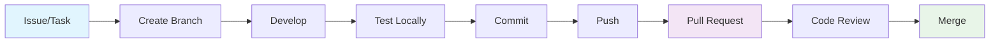

# LinkMeTur - Guia de Desenvolvimento

## 📋 Índice
- [Setup Inicial](#setup-inicial)
- [Ambiente de Desenvolvimento](#ambiente-de-desenvolvimento)
- [Padrões de Código](#padrões-de-código)
- [Workflow de Desenvolvimento](#workflow-de-desenvolvimento)
- [Testes](#testes)
- [Debug e Troubleshooting](#debug-e-troubleshooting)
- [Performance](#performance)
- [Contribuição](#contribuição)

## 🚀 Setup Inicial

### Pré-requisitos

Certifique-se de ter instalado:

- **Node.js** >= 18.0.0
- **npm** >= 8.0.0 ou **yarn** >= 1.22.0
- **Git** >= 2.30.0
- **VS Code** (recomendado) com extensões:
  - TypeScript and JavaScript Language Features
  - ESLint
  - Prettier
  - Tailwind CSS IntelliSense
  - Thunder Client (para testes de API)

### Instalação

```bash
# 1. Clone o repositório
git clone <repository-url>
cd linkmetur-api

# 2. Instale dependências do workspace root
npm install

# 3. Instale dependências do backend
cd backend
npm install

# 4. Instale dependências do frontend
cd ../frontend
npm install

# 5. Volte para o root
cd ..
```

### Verificação da Instalação

```bash
# Verificar versões
node --version    # >= 18.0.0
npm --version     # >= 8.0.0

# Verificar estrutura do projeto
ls -la            # Deve mostrar backend/, frontend/, package.json

# Verificar workspaces
npm run dev:backend --dry-run
npm run dev:frontend --dry-run
```

## 🛠️ Ambiente de Desenvolvimento

### Estrutura de Scripts

```json
{
  "scripts": {
    "dev:backend": "npm run start:dev --workspace backend",
    "dev:frontend": "npm run dev --workspace frontend",
    "dev": "concurrently \"npm run dev:backend\" \"npm run dev:frontend\"",
    "test:backend": "npm run test --workspace backend",
    "test:frontend": "npm run test --workspace frontend",
    "build:backend": "npm run build --workspace backend",
    "build:frontend": "npm run build --workspace frontend",
    "lint:backend": "npm run lint --workspace backend",
    "lint:frontend": "npm run lint --workspace frontend"
  }
}
```

### Desenvolvimento Simultâneo

Para desenvolver backend e frontend simultaneamente:

```bash
# Terminal 1 - Backend
npm run dev:backend

# Terminal 2 - Frontend  
npm run dev:frontend

# Ou usar concurrently (instalar se necessário)
npm install -g concurrently
npm run dev
```

### Variáveis de Ambiente

#### Backend (.env)
```env
PORT=5001
NODE_ENV=development
```

#### Frontend (.env.local)
```env
NEXT_PUBLIC_API_URL=http://localhost:5001
```

### Portas Padrão

- **Backend**: http://localhost:5001
- **Frontend**: http://localhost:3000
- **Swagger Docs**: http://localhost:5001/docs

## 📝 Padrões de Código

### TypeScript

```typescript
// ✅ Bom - Tipagem explícita
interface HealthResponse {
  status: 'ok' | 'error';
  service: string;
  timestamp?: Date;
}

const getHealth = async (): Promise<HealthResponse> => {
  // implementação
};

// ❌ Evitar - Any types
const getData = (): any => {
  // implementação
};
```

### Naming Conventions

```typescript
// ✅ Interfaces - PascalCase
interface UserData {}

// ✅ Classes - PascalCase  
class UserService {}

// ✅ Functions/Variables - camelCase
const getUserData = () => {};
const userData = {};

// ✅ Constants - UPPER_SNAKE_CASE
const API_BASE_URL = 'http://localhost:5001';

// ✅ Files - kebab-case ou camelCase
user-service.ts
userService.ts
```

### Estrutura de Arquivos

#### Backend
```
src/
├── modules/           # Feature modules
│   └── user/
│       ├── user.controller.ts
│       ├── user.service.ts
│       ├── user.module.ts
│       ├── dto/
│       └── entities/
├── common/           # Shared utilities
│   ├── decorators/
│   ├── filters/
│   ├── guards/
│   └── pipes/
└── config/          # Configuration
```

#### Frontend
```
src/
├── app/             # Next.js App Router
│   ├── (auth)/      # Route groups
│   ├── api/         # API routes
│   └── globals.css
├── components/      # Reusable components
│   ├── ui/          # Base UI components
│   └── forms/       # Form components
├── lib/            # Utilities
└── types/          # TypeScript types
```

### Padrões de Commit

Usar [Conventional Commits](https://www.conventionalcommits.org/):

```bash
# Features
git commit -m "feat: add user authentication endpoint"

# Bug fixes
git commit -m "fix: resolve CORS issue in health endpoint"

# Documentation
git commit -m "docs: update API documentation"

# Refactoring
git commit -m "refactor: improve error handling in controllers"

# Tests
git commit -m "test: add e2e tests for user module"

# Chores
git commit -m "chore: update dependencies"
```

## 🔄 Workflow de Desenvolvimento

### Fluxo de Features



### Branch Strategy

```bash
# Main branches
main          # Produção
develop       # Desenvolvimento

# Feature branches
feature/user-auth
feature/booking-system
feature/payment-integration

# Hotfix branches
hotfix/security-patch
hotfix/critical-bug

# Release branches
release/v1.1.0
```

### Comandos Essenciais

```bash
# Criar nova feature
git checkout -b feature/nova-funcionalidade
git push -u origin feature/nova-funcionalidade

# Desenvolvimento
npm run dev:backend    # Terminal 1
npm run dev:frontend   # Terminal 2

# Testes antes do commit
npm run test:backend
npm run lint:backend
npm run lint:frontend

# Commit e push
git add .
git commit -m "feat: implementar nova funcionalidade"
git push origin feature/nova-funcionalidade
```

## 🧪 Testes

### Backend Testing

#### Unit Tests
```bash
# Executar todos os testes
npm run test --workspace backend

# Executar com watch mode
npm run test:watch --workspace backend

# Executar com coverage
npm run test:cov --workspace backend

# Executar teste específico
npm run test --workspace backend -- user.service.spec.ts
```

#### E2E Tests
```bash
# Executar testes E2E
npm run test:e2e --workspace backend

# Debug mode
npm run test:debug --workspace backend
```

#### Exemplo de Teste

```typescript
// user.service.spec.ts
describe('UserService', () => {
  let service: UserService;

  beforeEach(async () => {
    const module: TestingModule = await Test.createTestingModule({
      providers: [UserService],
    }).compile();

    service = module.get<UserService>(UserService);
  });

  describe('findAll', () => {
    it('should return an array of users', async () => {
      const result = await service.findAll();
      expect(result).toBeInstanceOf(Array);
    });
  });
});
```

### Frontend Testing

```bash
# Executar testes (quando implementados)
npm run test --workspace frontend

# Executar com watch mode
npm run test:watch --workspace frontend
```

### Testes de API Manual

#### Usando cURL
```bash
# Health check
curl -X GET http://localhost:5001/health

# Com headers
curl -X GET http://localhost:5001/health \
  -H "Accept: application/json" \
  -H "Origin: http://localhost:3000"
```

#### Usando Thunder Client (VS Code)
```json
{
  "method": "GET",
  "url": "http://localhost:5001/health",
  "headers": {
    "Accept": "application/json"
  }
}
```

## 🐛 Debug e Troubleshooting

### Debug do Backend

#### VS Code Debug Configuration
```json
// .vscode/launch.json
{
  "version": "0.2.0",
  "configurations": [
    {
      "name": "Debug NestJS",
      "type": "node",
      "request": "launch",
      "program": "${workspaceFolder}/backend/src/main.ts",
      "args": [],
      "runtimeArgs": [
        "-r", "ts-node/register",
        "-r", "tsconfig-paths/register"
      ],
      "cwd": "${workspaceFolder}/backend",
      "env": {
        "NODE_ENV": "development"
      }
    }
  ]
}
```

#### Debug com Logs
```typescript
// Usar Logger do NestJS
import { Logger } from '@nestjs/common';

export class UserService {
  private readonly logger = new Logger(UserService.name);

  async findUser(id: string) {
    this.logger.debug(`Finding user with id: ${id}`);
    // implementação
  }
}
```

### Problemas Comuns

#### CORS Issues
```typescript
// main.ts - Configuração CORS
app.enableCors({
  origin: ['http://localhost:3000', 'http://localhost:3001'],
  credentials: true,
});
```

#### Port Already in Use
```bash
# Encontrar processo na porta 5001
lsof -ti:5001

# Matar processo
kill -9 $(lsof -ti:5001)

# Ou usar porta diferente
PORT=5002 npm run start:dev
```

#### Module Resolution Issues
```typescript
// tsconfig.json - Paths
{
  "compilerOptions": {
    "baseUrl": "./",
    "paths": {
      "@/*": ["src/*"],
      "@/common/*": ["src/common/*"]
    }
  }
}
```

### Logs e Monitoring

#### Structured Logging
```typescript
import { Logger } from '@nestjs/common';

const logger = new Logger('UserController');

logger.log('User created successfully', { userId: 123 });
logger.error('Failed to create user', error.stack);
logger.warn('Deprecated endpoint accessed');
logger.debug('Debug info', { context: 'development' });
```

## ⚡ Performance

### Backend Optimization

#### Database Queries (Futuro)
```typescript
// ✅ Bom - Usar índices
const users = await this.userRepository.find({
  where: { email: 'user@example.com' }, // indexed field
});

// ❌ Evitar - N+1 queries
const posts = await this.postRepository.find();
for (const post of posts) {
  post.author = await this.userRepository.findOne(post.authorId);
}

// ✅ Melhor - Eager loading
const posts = await this.postRepository.find({
  relations: ['author'],
});
```

#### Memory Management
```typescript
// ✅ Cleanup de recursos
@Injectable()
export class DataService implements OnModuleDestroy {
  private connections: Connection[] = [];

  onModuleDestroy() {
    this.connections.forEach(conn => conn.close());
  }
}
```

### Frontend Optimization

#### Next.js Optimization
```typescript
// ✅ Server Components para data fetching
async function UserProfile({ userId }: { userId: string }) {
  const user = await fetchUser(userId); // Server-side
  return <div>{user.name}</div>;
}

// ✅ Dynamic imports
const HeavyComponent = dynamic(() => import('./HeavyComponent'), {
  loading: () => <p>Loading...</p>,
});

// ✅ Image optimization
import Image from 'next/image';

<Image
  src="/user-avatar.jpg"
  alt="User Avatar"
  width={100}
  height={100}
  priority
/>
```

### Monitoring

#### Performance Metrics
```typescript
// Middleware para timing
export function TimingMiddleware(req: Request, res: Response, next: NextFunction) {
  const start = Date.now();
  
  res.on('finish', () => {
    const duration = Date.now() - start;
    console.log(`${req.method} ${req.path} - ${duration}ms`);
  });
  
  next();
}
```

## 🤝 Contribuição

### Code Review Checklist

#### Geral
- [ ] Código segue padrões estabelecidos
- [ ] Testes incluídos e passando
- [ ] Documentação atualizada
- [ ] Sem console.logs em produção
- [ ] Tratamento de erros adequado

#### Backend
- [ ] DTOs validados corretamente
- [ ] Endpoints documentados no Swagger
- [ ] Testes E2E incluídos
- [ ] Logging apropriado
- [ ] Segurança considerada

#### Frontend
- [ ] Componentes responsivos
- [ ] Acessibilidade considerada
- [ ] Performance otimizada
- [ ] Error boundaries implementados
- [ ] SEO considerado

### Pull Request Template

```markdown
## Descrição
Breve descrição das mudanças implementadas.

## Tipo de Mudança
- [ ] Bug fix
- [ ] Nova feature
- [ ] Breaking change
- [ ] Documentação

## Testes
- [ ] Testes unitários passando
- [ ] Testes E2E passando
- [ ] Testado manualmente

## Checklist
- [ ] Código revisado
- [ ] Documentação atualizada
- [ ] Padrões seguidos
- [ ] Performance considerada
```

### Ferramentas de Desenvolvimento

#### Extensões VS Code Recomendadas
```json
{
  "recommendations": [
    "ms-vscode.vscode-typescript-next",
    "dbaeumer.vscode-eslint",
    "esbenp.prettier-vscode",
    "bradlc.vscode-tailwindcss",
    "rangav.vscode-thunder-client",
    "ms-vscode.vscode-json"
  ]
}
```

#### Configuração do Prettier
```json
// .prettierrc
{
  "semi": true,
  "trailingComma": "es5",
  "singleQuote": true,
  "printWidth": 80,
  "tabWidth": 2
}
```

---

**Última atualização**: Setembro 2025
**Versão do Guia**: 1.0.0
**Para dúvidas**: Abrir issue no repositório
